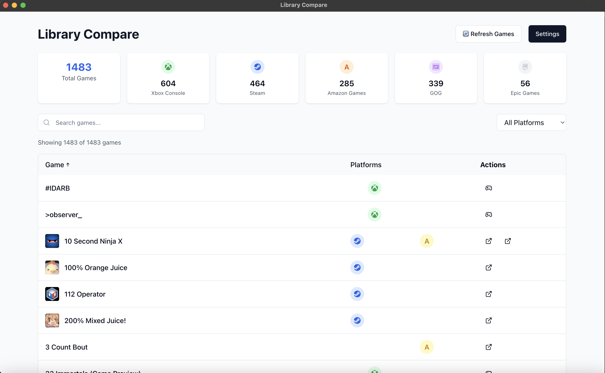

# Library Compare

A modern Electron desktop application that allows you to view and compare your game libraries across multiple platforms including Steam, Xbox, GOG, Epic Games, and Amazon Games in a unified interface.



## Features

🎮 **Multi-Platform Support**
- Steam library integration via Steam Web API
- Xbox library integration with Microsoft OAuth
- GOG library integration using bundled gogdl binary
- Epic Games Store integration with OAuth authentication
- Amazon Games integration with web scraping

📊 **Unified View**
- Compare games across all platforms in one table
- See which games you own on multiple platforms
- Track playtime across different platforms
- Beautiful, responsive desktop interface

🔍 **Smart Features**
- Search and filter games by name or platform
- Sort by name, playtime, or number of platforms
- Platform-specific badges and icons
- Intelligent game caching for faster loading

💾 **Data Management**
- Local caching of game libraries for offline viewing
- Secure credential storage using Electron Store
- No data sent to external servers - everything stays local

## Getting Started

### Prerequisites

- Node.js 18+ 
- pnpm package manager (recommended) or npm/yarn

### Installation

1. Clone the repository:
```bash
git clone <repository-url>
cd library-compare
```

2. Install dependencies:
```bash
pnpm install
```

3. Start the development server:
```bash
pnpm start
```

### Building for Production

Build the application for your platform:

```bash
# Build for current platform
pnpm dist

# Build for specific platforms
pnpm dist:mac    # macOS
pnpm dist:win    # Windows
pnpm dist:linux  # Linux
```

## Platform Setup

### Steam Integration

1. **Get your Steam API Key:**
   - Visit [Steam Web API Key](https://steamcommunity.com/dev/apikey)
   - Sign in and register for an API key
   - Use any domain name (e.g., localhost)

2. **Find your Steam ID:**
   - Use tools like [steamid.io](https://steamid.io) to find your 64-bit Steam ID
   - Make sure your Steam profile and game library are set to public

### Xbox Integration

1. **Microsoft OAuth Authentication:**
   - Click "Authenticate with Xbox" in the app
   - Sign in with your Microsoft account
   - Grant permissions for Xbox Live access
   - No additional setup required

2. **Profile Requirements:**
   - Ensure your Xbox profile allows friends to see your game library

### GOG Integration

1. **GOG Galaxy Authentication:**
   - Click "Authenticate with GOG" in the app
   - Sign in with your GOG account
   - Uses bundled `gogdl` binary for secure authentication
   - No additional API keys required

### Epic Games Integration

1. **Epic OAuth Authentication:**
   - Click "Authenticate with Epic Games" in the app
   - Complete the OAuth flow in your browser
   - Copy the authorization code back to the app
   - Credentials are stored securely

### Amazon Games Integration

1. **Amazon Authentication:**
   - Click "Authenticate with Amazon Games" in the app
   - Sign in with your Amazon account
   - Uses web scraping to access your library
   - Credentials stored locally and securely

## Technology Stack

- **Framework**: Electron with Vite
- **Frontend**: React 18 with TypeScript
- **Styling**: Tailwind CSS
- **Icons**: Lucide React + FontAwesome
- **State Management**: React hooks
- **Data Storage**: Electron Store
- **Build Tool**: Electron Builder

## Project Structure

```
src/
├── main/                    # Electron main process
│   ├── main.ts             # Main Electron entry point
│   ├── steam-api.ts        # Steam Web API integration
│   ├── xbox-api.ts         # Xbox Live OAuth & API
│   ├── gog-api.ts          # GOG Galaxy integration
│   ├── epic-api.ts         # Epic Games Store API
│   ├── amazon-api.ts       # Amazon Games integration
│   └── icon-cache.ts       # Game icon caching service
├── preload/                # Electron preload scripts
│   └── preload.ts          # IPC bridge for renderer
├── renderer/               # React frontend
│   ├── components/         # React components
│   │   ├── ui/            # Reusable UI components
│   │   ├── GameTable.tsx  # Main game display table
│   │   ├── ApiKeySetup.tsx # Platform authentication
│   │   └── PlatformIcons.tsx # Platform-specific icons
│   ├── lib/               # Frontend utilities
│   │   ├── gameLibrary.ts # Game library manager
│   │   ├── gameCache.ts   # Local game caching
│   │   └── utils.ts       # Utility functions
│   ├── screens/           # Main application screens
│   │   └── Library.tsx    # Primary library view
│   └── types/             # TypeScript definitions
└── types/                 # Shared type definitions
    └── game.ts            # Game data interfaces
```

## API Integrations

### Steam Web API
- Uses `GetOwnedGames` endpoint to fetch complete game library
- Includes playtime data, last played dates, and game metadata
- Fetches game details and images from Steam store
- Requires Steam API key and Steam ID

### Xbox Live API
- Direct integration with Microsoft's Xbox Live services
- OAuth 2.0 authentication flow
- Fetches owned games, achievements, and playtime data
- No third-party services required

### GOG Galaxy Integration
- Uses bundled `gogdl` binary (similar to Heroic Games Launcher)
- Secure OAuth authentication with GOG
- Fetches complete owned games library
- Includes game metadata and installation status

### Epic Games Store API
- OAuth integration with Epic Games services
- Fetches owned games from Epic Games Store
- Includes free games claimed through Epic
- Secure credential storage

### Amazon Games Integration
- Web scraping integration for Amazon Games
- Fetches games from Amazon Games library
- Includes Prime Gaming titles
- Secure session management

## Privacy & Security

- **Local-First**: All data processing happens on your device
- **Secure Storage**: API keys and tokens stored using Electron Store encryption
- **No Telemetry**: No usage data or personal information sent to external servers
- **Direct API Calls**: All platform APIs called directly from your machine
- **Open Source**: Full source code available for security review

## Contributing

1. Fork the repository
2. Create a feature branch (`git checkout -b feature/amazing-feature`)
3. Commit your changes (`git commit -m 'Add some amazing feature'`)
4. Push to the branch (`git push origin feature/amazing-feature`)
5. Open a Pull Request

## Development

### Running in Development
```bash
pnpm start          # Start development with hot reload
pnpm build          # Build for production
pnpm lint           # Run ESLint
pnpm type-check     # Run TypeScript checks
```

### Platform-Specific Builds
```bash
pnpm dist:mac       # Build for macOS (requires macOS)
pnpm dist:win       # Build for Windows
pnpm dist:linux     # Build for Linux
```

## Roadmap

- [x] Steam integration with full library support
- [x] Xbox Live integration with OAuth
- [x] GOG Galaxy integration with gogdl
- [x] Epic Games Store integration
- [x] Amazon Games integration
- [x] Local game caching system

## System Requirements

- **macOS**: 10.15 (Catalina) or later
- **Windows**: Windows 10 or later
- **Linux**: Ubuntu 18.04, Fedora 32, Debian 10, or equivalent

## License

This project is licensed under the MIT License - see the [LICENSE](LICENSE) file for details.

## Support

If you encounter any issues or have questions:
- Open an issue on GitHub
- Check existing issues for solutions
- Provide detailed information about your system and the problem

## Acknowledgments

- Built with [Electron](https://www.electronjs.org/)
- Uses [gogdl](https://github.com/Heroic-Games-Launcher/gogdl) for GOG integration
- Inspired by game library managers like Heroic Games Launcher
- Icons provided by [Lucide](https://lucide.dev/) and [FontAwesome](https://fontawesome.com/)